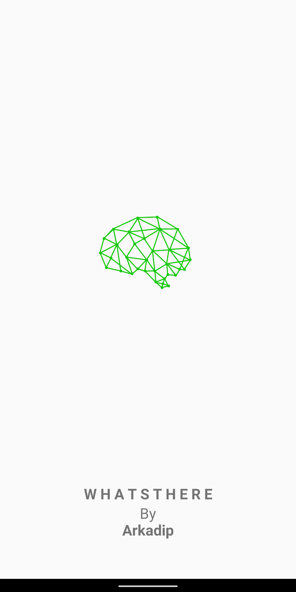
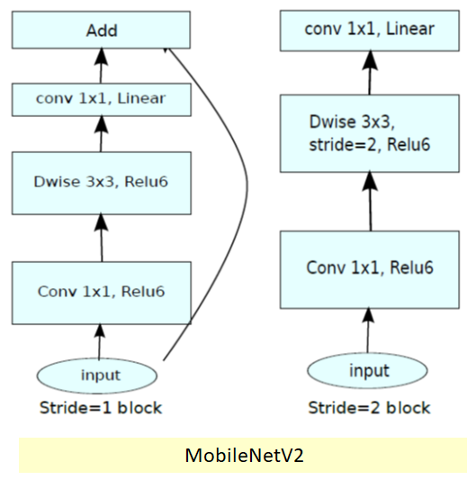
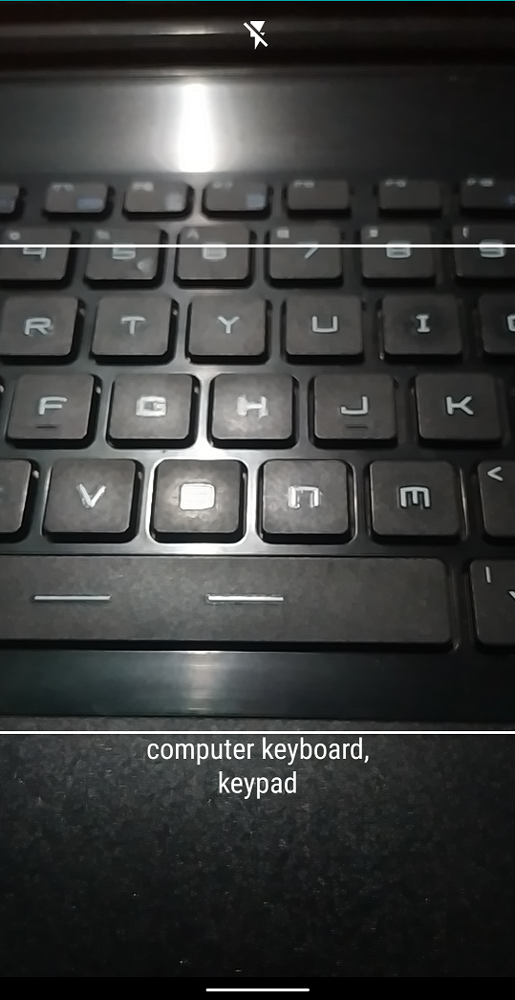

# WhatsThere

An Android Application, which can `sence` and `classify` Real objects and can tell, what the object is.

The App is created on top of `Deep Learning` and `Aritificial Neural Networks`.
**`WhatsThere`** is a great example, that how `Artificial Inteligence` can do a lot of job without any Human interfare.

## Features

1. The App can sence **1000** different kinds of objects, from `Keyborads` to `Dog Bread`
2. The App has a *Flash* On/Off button, so the app can see clearly at night.
3. The *Camera Focus* is automatically adjusted, so you don't have to bother to focus any object.

> Last but not least

4. The App is so **light weight** and can do it's job very precisely even in **VERY LOW SPECS Device**.

## Technology

- The App is created for and only for **`Android`**, `2 minutes of silence for other platforms`
- To power-up the Deepest Neural Network, the App uses **`PyTorch`**
- Written in *`Shuddh`* **`JAVA`**
- Uses [**`CameraX`**](https://developer.android.com/training/camerax) to Capture frames

## Neural Network

- The App uses the pretrained `MobileNet-v2` model as it's classifier backend

## Example Images

## Maintainer

 

**[Arkadip Bhattacharya](https://www.linkedin.com/in/arkadip/)**

  

> ***Need help?***
***Feel free to contact me @ [in2arkadipb13@gmail.com](mailto:in2arkadipb13@gmail.com?Subject=Github:Udacity-Computer-Vision-Nanodegree-Repository)***

  

