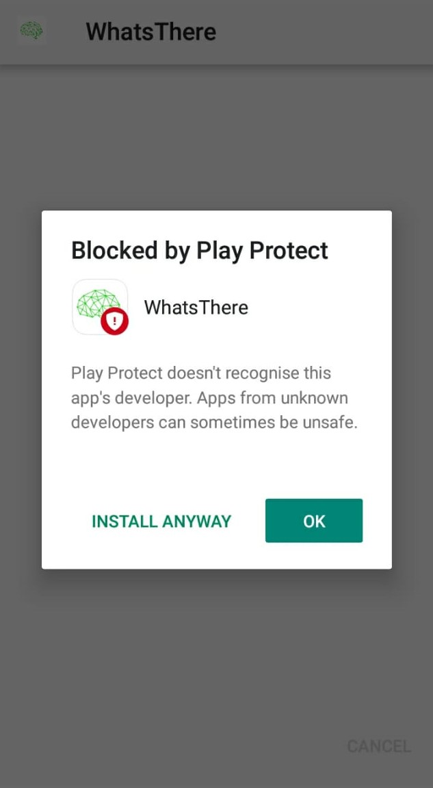

# WhatsThere

## Installation Guideline

1. Download the latest Application from [Here](https://github.com/darkmatter18/WhatsThere/releases/latest/download/WhatsThere.apk)

2. Make Sure you turned on **Allow Installation from Unknown Sources**. If you didn't do that, Android will prompt you to do so.

3. Install the App, by **Clicking the Install Button**.

4. If you get a prompt like this, make sure you click **INSTALL ANYWAY**, otherwise the app will not install.

Play Protect does not recognize me as an autherized developer. THat's why it is giving such a message.

5. If you get another prompt like this, make sure you click **SEND**

This will send google the app information. It will help the app to *mark as safe*.

6. Now the app should be installed and work properly.

> ***Need help?***
***Feel free to contact me @ [in2arkadipb13@gmail.com](mailto:in2arkadipb13@gmail.com?Subject=Github:Udacity-Computer-Vision-Nanodegree-Repository)***